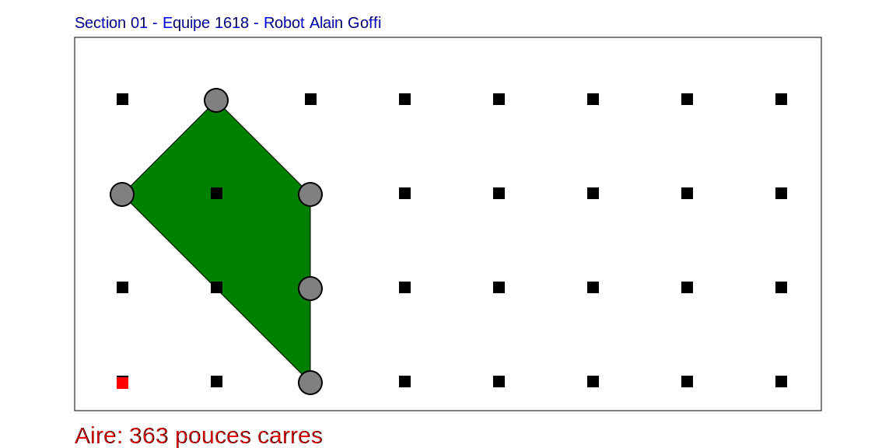

# MapperBot

Creating a robot that can detect poles on a table and map them out. Afterwards, it creates a convex hull with the poles it detected, calculates the area of the convex hull and transmits an image of the final map back to the computer.


## Authors

- [@gabcomby](https://github.com/gabcomby)
- [@Maxsavy](https://github.com/Maxsavy)
- [@charlo3112](https://github.com/charlo3112)


## Created For

This project was created for the class INF1900 at Polytechnique Montreal.


## Screenshots
This is an example of a result that'd be transmitted from the robot to the computer.



## Software Requirement
The following programs are required to use this project:

1. [serieViaUSB](https://github.com/marcantoinem/serieviausb)
2. [AVR-GCC compiler](https://www.microchip.com/en-us/tools-resources/develop/microchip-studio/gcc-compilers)
3. [Make](https://www.gnu.org/software/make/)
## Installation

Plug-in your ATMega324PA using a USB cable, then follow these steps.

1. Clone the project

```bash
  git clone https://github.com/gabcomby/MapperBot.git
  cd MapperBot
```

2. Build the library
```bash
  cd lib
  make clean && make
  cd ..
```

3. Install the program onto the microcontroller
```bash
  cd app
  make clean && make install
  cd ..
```

4. Once the robot has finished its run, plug it back in and run the following commands to get the SVG & the CRC32 hash:
```bash
  serieViaUSB -l
```
## Using The Robot

1. After the program was installed on it, unplug the robot from the computer.
2. Turn on the power for the microcontroller & the H-Bridge
3. Place the robot on the table
4. Enter detection mode by pushing the "Interrupt" button
5. After each pole detection, please re-press the "Interrupt" button
6. Once all desired poles have been detected, press the "Reset" button
7. Plug the robot back into the computer, and run step 4 of the "Installation" chapter
8. Press the white button located on the breadboard

## Academic Integrity Notice

This project is shared publicly on GitHub for educational purposes only. The code and accompanying resources are provided under the MIT License, which allows for the use, modification, and distribution of this software, subject to the conditions specified in the license.

However, using this project, in part or in full, to complete a school assignment, coursework, or any other academic task WITHOUT proper attribution or consent is STRICTLY PROHIBITED. By using this project, you agree to respect the principles of academic integrity and avoid any form of plagiarism.

If you are a student and wish to use or reference this project in your academic work, please ensure that you properly cite the source, giving credit to the original author. Consult your institution's guidelines on citation and attribution to ensure compliance with academic integrity policies.

Failure to comply with this notice and the principles of academic integrity may result in disciplinary action from your educational institution, up to and including expulsion.

If you have any questions or concerns regarding the use of this project, please contact the original author.
